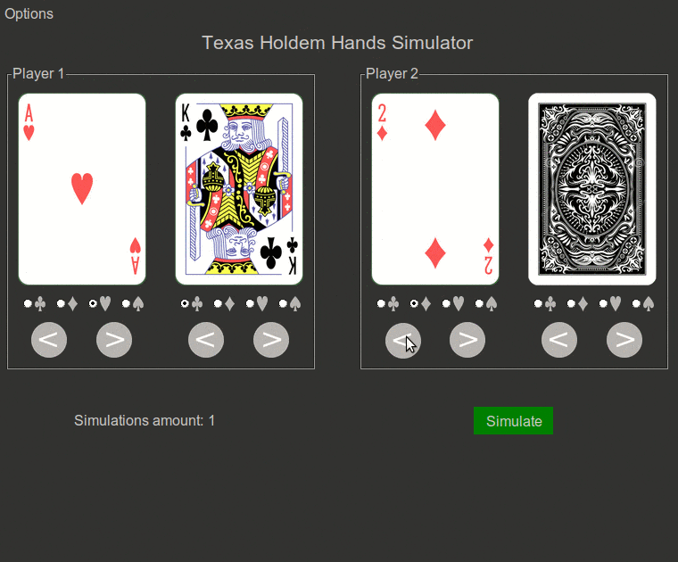

    
     

---
### About the application    
HandSim, created in Python module Tkinter, is a Texas Holdem game simulator. It gets cards chosen by player, or picks random cards by itself as input. Then it simulates number of games and shows results. Simulation is done in a seperate thread, to make GUI responsive. If simulation takes longer than few seconds, progress bar appears to inform user how much time it is going to take. Application also saves and averages simulation times. The more games it simulates, the more accurate time estimations are. Available options:

* two or three players simulation
* two sizes of the application

**How to launch**
Right now there is no option to install. To launch the application, have Python 3 installed with all packages included in the Pipfile in this repository.    

**Check out how it works [HERE](https://www.youtube.com/watch?v=vyhMNOibmKc)**

